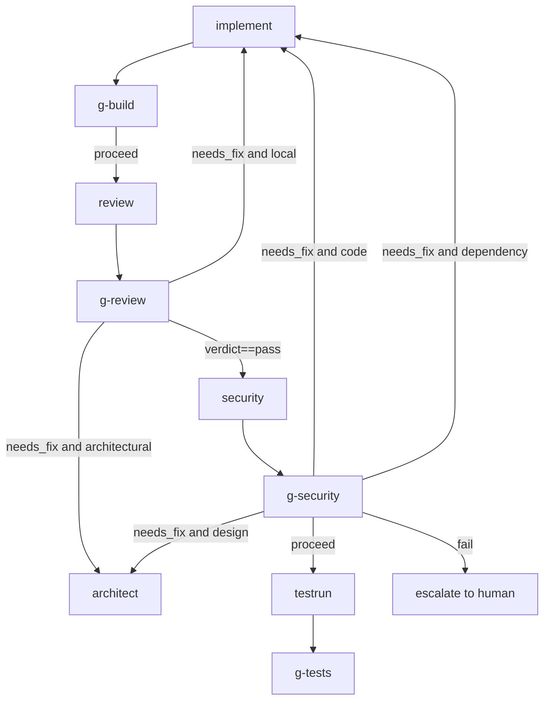
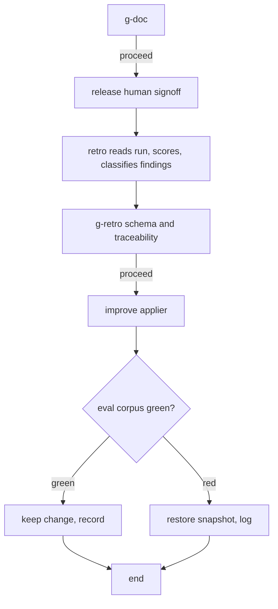

# Delivery Pipeline v2 — Specification

## 0. Read this first — the framing is wrong, and it matters

The brief says security review, self-improvement, and tool evolution are **missing**. That is
true of the **portable `packages/delivery-workflow/` package** (delivery/v1). It is **false of
the repository**. All three already exist as working code in the older CC-v1 / Cronos-coupled
layer:

| Requested capability | Already exists as | Status in delivery/v1 |
|---|---|---|
| Security review agent | `.claude/agents/security-officer.md` (OWASP Top-10 framing, ~12 grep sweeps, pip-audit/npm-audit, full report format) | **absent** from the package |
| Self-improvement | `.claude/agents/pipeline-retro.md` + `backend/app/pipeline/auto_improver.py` (snapshot → apply → re-eval → keep/rollback, 31 KB) | **absent** from the package |
| Tool evolution | `.claude/agents/evolve-tools.md` + `backend/app/tools/{evolve,discovery,adoption,scanner}.py` + `evolve_tools_loop` in `main.py:144` | **absent** — and **stays in Cronos** (out of v2 scope, §4) |

**Confidence: HIGH** (I read all of these files, paths above).

This reframes v2 entirely. The job is **not** greenfield design — it is **harvest → re-target →
make-portable → integrate**, which is the project's own established method (the v1 `reviewer`
agent was harvested the same way: 401 lines → 63-line agent + 100-line skill). Treating these as
new inventions would discard working, tested prior art and is the wrong starting posture.

Two consequences follow immediately:

1. **De-risking.** Each feature has a concrete harvest source, so the spec below is mostly a
   port-and-adapt plan, not speculation. Lower delivery risk, higher confidence in estimates.
2. **One genuine design fork** needed a real decision, and it was **not** in the brief: how
   aggressive self-improvement is allowed to be (§3.2). Silently rewriting the pipeline's own
   agents is a reliability anti-pattern. **Resolved:** the tiered auto-apply boundary (Tier 0
   auto-apply / Tier 1 PR / Tier 2 escalate) is accepted — prompt edits are never auto-applied
   in-place.

> **Scope decision (revision 2).** **Tool evolution (formerly F3) is removed from v2 and stays in
> Cronos.** Rationale: tool evolution requires a net-new *per-tool-call* telemetry axis (success
> / error / human-rescue rates aggregated across runs) that does not exist in the portable core.
> Putting it in the delivery pipeline would chain the portable pipeline to Cronos's trace/
> telemetry infrastructure — exactly the coupling the package exists to avoid. The existing
> Cronos subsystem (`evolve-tools.md` + `backend/app/tools/evolve.py` + `evolve_tools_loop`)
> already does this well; it remains there. See §4 for the recorded decision. Removing it also
> makes the **remaining** v2 features cleanly standalone-targetable (§5).

---

## 1. Scope and non-goals

### In scope
- **F1 — Security review node + agent + skill + loop-back**, mirroring the `review`/`g-review`
  two-half pattern (agent judgment + gate that re-executes real scanners).
- **F2 — Self-improvement**: a `retro` node + an `improve` applier, re-targeted from CC-v1 to
  delivery/v1 state, with a **tiered auto-apply boundary** (accepted, §3.2).
- **Cronos + standalone parity** for both, to the degree each can achieve it (they differ — see
  §5; stated honestly per feature, not as a blanket "yes").

### Non-goals (v2)
- **Tool evolution** — handled in Cronos, not the delivery pipeline. It needs a per-tool-call
  telemetry axis that would couple the portable core to Cronos's trace infrastructure. The
  existing Cronos subsystem keeps it. Recorded decision in §4.
- Re-architecting v1's executor interface or graph model. v2 is additive.
- Building the standalone runner from scratch. The package `runner/` is still deferred
  (`runner/__init__.py` is a one-line stub: *"deferred to Phase 6"*). v2 specifies what the
  runner must support for these features; it does not deliver the runner.
- Auto-merging any change that alters a contract, schema, or agent prompt without a gate and a
  human in the loop (see §3.2 — this is a hard line, not a deferral).

---

## 2. F1 — Security review

### 2.1 The load-bearing design decision

The existing `security-officer` is an **LLM-only** auditor: it greps, reads, and writes a report
based on its own judgment. For a *gate that blocks a release*, LLM-only is **not acceptable** —
it has both false positives (blocks good code on a hunch) and, worse, false negatives (passes a
real CVE because the model didn't notice). 

v1 already solved exactly this class of problem. `g-build` does **not** trust the implementor's
self-reported `validation_command_passed` flag — it **re-executes** the command
(`backend/app/pipeline/gate.py:300-334`, `_check_build`). Security must follow the same rule.

**Decision (confidence HIGH): security is two halves, exactly like `review`.**

- **`security` agent node** — LLM judgment over the diff + design. Produces structured findings,
  a `verdict`, and a routing `finding_class`. Harvested from `security-officer.md`, re-shaped to
  the v1 `reviewer` exemplar (thin agent + paired skill, `delivery_status` fence, no hardcoded
  paths). *Draft delivered: `agents/security-reviewer.md`, `skills/security-review/SKILL.md`.*
- **`g-security` gate** with a **new `security` check type** that **re-executes real scanners**
  and reconciles them against the agent's findings. The gate's decision — not the agent's
  verdict — is what the harness routes on for the tool-corroborated classes.

Rejected alternative — *single combined review+security mega-agent*: violates the
single-responsibility shape every v1 agent follows, needs a different toolset (scanners) and a
different skill, and muddies `finding_class` routing. Rejected, confidence HIGH.

Rejected alternative — *LLM-only security gate (no scanners)*: rejected for the false-negative
reason above. The whole point of v1's outcome gates is "re-execute the claim, don't trust the
report." A security gate that trusts the model is a contradiction of the architecture.

### 2.2 Graph placement and loop-back



**Placement: after `g-review` passes, before `testrun`. Confidence MEDIUM.**

Rationale: code quality is settled first, so security reviews code that is not about to be
rewritten for a style/structure finding. The cost is that a security `needs_fix → implement`
re-triggers the `review` loop on the next pass. **This is acceptable and arguably correct**: a
security fix *should* be re-reviewed. The diff on a re-pass is small, so the re-review is cheap.

The honest alternative is **Option B: run `review` and `security` in parallel off `g-build`,
joined by a merge gate.** It saves the re-review pass. It is **not recommended for v2** because
v1 has no demonstrated parallel-fan-in-with-join gate primitive — edges are 1:1 conditional
branches; the only fan-in is via `inputs.from` (e.g. `architect` reads `[analyze, frontend]`),
not a gate that waits on two agents. Building that primitive is its own work. Flagged as the
optimization to revisit once a join primitive exists.

### 2.3 Routing taxonomy (constrained by the condition grammar)

The edge condition grammar (`backend/app/harnesses/decision.py:346`, `eval_condition`) supports
`==`, `!=`, `in`, and `&&` conjunction — **but no `||` (OR)**. So each routing target is its own
edge (mirroring how `review` uses separate `local`/`architectural` edges). Three classes:

| `finding_class` | Meaning | Routes to | Fix kind |
|---|---|---|---|
| `code` | In-place vulnerable pattern *or* misconfiguration (injection, XSS, hardcoded secret, path traversal, CORS-too-open, debug flag, missing security header) | `implement` | edit code/config |
| `dependency` | Known-vulnerable package (CVE surfaced by pip-audit / npm audit) | `implement` | bump / replace dep |
| `design` | The security flaw is architectural (broken auth model, wrong trust boundary, missing authz layer) — a code edit cannot fix it | `architect` | design change |

`config` is deliberately folded into `code` (both are in-place edits the implementor makes) to
avoid a fourth edge. The agent sets the class using exactly the same `architectural-vs-local`
discipline the `code-review` skill already defines (§6 of that skill) — `design` is the
expensive path, reserved for what a fix genuinely cannot resolve. **When in doubt, `code`.**

### 2.4 The `security` gate check (re-execution)

New handler `_check_security` registered in `CHECK_REGISTRY` (`gate.py:631`). It runs the actual
scanners through the existing `_run_command` subprocess boundary (`gate.py:84`) — the same
boundary `build`/`lint`/`types`/`test` already use — and gates on results:

```yaml
- id: g-security
  kind: gate
  checks:
    - type: security
      scanners:                       # each optional; skipped-if-absent is itself recorded
        sast:        "semgrep --config auto --json --quiet ."   # or bandit for py-only
        secrets:     "gitleaks detect --no-banner --report-format json --report-path -"
        deps_python: "pip-audit --format json"
        deps_node:   "npm audit --json"
      fail_on:        [critical, high]   # severities that force needs_fix
      reconcile:      true               # cross-check agent findings vs scanner output
```

Decision logic, following the `needs_fix > proceed` precedence already in `runGate`
(`gate.py:727-731`):

- Any scanner reports a finding at a `fail_on` severity → **`needs_fix`** (loop back; class
  derived: dep-scanner hit ⇒ `dependency`, SAST/secret hit ⇒ `code`).
- Scanner binary missing → **record as evidence, do not silently pass.** A gate that passes
  because the scanner wasn't installed is a false negative. Policy choice (config flag):
  `on_missing_scanner: [skip | fail]`, default `fail` in CI, `skip` locally.
- `reconcile: true` — if the agent flagged a `critical`/`high` finding that **no** scanner
  corroborates, keep it (LLM can see logic flaws scanners can't) but tag it `unverified`; if a
  scanner found something the agent **missed**, that is a finding *and* a signal the agent/skill
  needs improvement (feeds F2 — see §4, the loop closes on itself).
- Hard infrastructure failure (e.g. scanner crash, not a finding) → **`retry`** (short-circuits,
  per `gate.py:719`).

**Why this is the right shape, confidence HIGH:** it is identical in structure to the gates that
already work. The agent provides reasoning and context (severity triage, exploitability, design
findings scanners can't see); the gate provides ground truth (CVEs, secret entropy hits, AST
pattern matches). Neither alone is trustworthy; together they are.

### 2.5 Portability (F1 is the *most* portable feature)

The scanners are environment tools, not Cronos. `_check_security` shells out exactly as
`_check_build` does. So:

- Portable: the agent (`.md`), the skill (`SKILL.md`), the gate-check *logic*.
- The **one Cronos coupling to sever**: `security-officer.md` hardcodes
  `REPO_ROOT=/data/spaces/${space_id}`. The v2 agent takes its paths from the runtime
  (`reviewer.md` rule: *"paths are supplied by the runtime — never hardcode a path"*).
- The check is registered in **two** gate engines: Cronos `app.pipeline.gate.CHECK_REGISTRY`
  now, and the portable runner's gate engine when Phase 6 lands. The check *body* is identical
  and should live in a portable module that both import — candidate: move scanner-shelling into
  `packages/delivery-workflow/lib/` so the Cronos gate and the standalone gate share one
  implementation rather than forking. **Recommended, confidence MEDIUM** (depends on Phase-6
  gate-engine shape, which doesn't exist yet).

### 2.6 F1 acceptance criteria

- [ ] `agents/security-reviewer.md` exists in the package, mirrors the `reviewer` shape (thin
      agent, loads paired skill, `delivery_status` fence, no hardcoded paths).
- [ ] `skills/security-review/SKILL.md` exists, carries the method (threat taxonomy, severity
      ladder, the harvested grep sweeps, false-positive triage, finding format).
- [ ] `security` added to the gate-check enum in `schemas/delivery.workflow.schema.yaml`
      (currently closed list: `schema|traceability|acceptance|build|lint|types|test|diff_vs_acceptance|custom`).
- [ ] `_check_security` implemented and registered in `gate.py:CHECK_REGISTRY`; re-executes
      scanners through `_run_command`; honours `fail_on`, `on_missing_scanner`, `reconcile`.
- [ ] `security` + `g-security` nodes and the four routing edges added to
      `delivery.workflow.yaml`; placement = after `g-review` pass, before `testrun`.
- [ ] `security` agent node carries a `loop` block (until `verdict==pass`, stall on
      `recurring_findings`, `max: 3`, `on_exhaust: escalate`) — mirrors `review`'s loop.
- [ ] Gate test exercises a **real** subprocess against a fixture repo with a known-vulnerable
      dependency and a planted secret — **not** a mocked gate result. *(This explicitly closes
      the open P1 from the v1 review: "e2e mocks the gate result rather than exercising a real
      subprocess.")*
- [ ] Scanner-missing path proven to NOT pass silently (asserts `fail` in CI mode).
- [ ] Import-boundary test still green (no `app.*` import added to portable core;
      `tests/test_import_boundary.py`).

---

## 3. F2 — Self-improvement

### 3.1 Harvest and re-target

Source: `pipeline-retro.md` + `auto_improver.py`. The **safety pattern is excellent and is
kept verbatim in spirit**: snapshot every touched file → apply → re-run the eval corpus → if
green keep, **if red restore from the in-memory snapshot and roll back the version bump**
(`auto_improver.py` docstring + `_Snapshot` at line 329). This is exactly how a self-modifying
system should behave. Do not weaken it.

What must change — it is bound to **CC-v1**, the wrong pipeline:

| CC-v1 (current) | delivery/v1 (re-target to) |
|---|---|
| `pipeline-state.json`, `phases-log.jsonl` | `state.json`, `events.jsonl` (`lib/state/`) |
| `STATUS:` marker, `python -m app.pipeline.verify` | `delivery_status` fence (`lib/delivery_status.py`) |
| `CC_VERSION` bump across `contract.py` + schemas | delivery/v1 has no contract-version concept yet — scope this out or define one |
| scoring on 5 dims (planning/error_handling/…) | keep the rubric; read delivery/v1 traces (`RunTrace` in `trace_parser.py` — same fields the `evaluate-run` skill scores on) |
| `fix_type` enum `{normalize_rule, verifier_rule_or_schema_field, agent_prompt_refinement, contract_change}` | delivery/v1-native enum `{fixture, threshold, gate_check, agent_prompt, skill, schema, workflow}`, same tier mapping (§3.2): fixture/threshold→T0, gate_check/agent_prompt/skill→T1, schema/workflow→T2 |

The `retro` node is **terminal and read-only** (it *proposes*; it never edits — same hard rule
as CC-v1 `pipeline-retro`). It runs **after `release`**, mirroring "after a pipeline goal
finalises." Then a separate `improve` applier consumes the retro findings under a gate.
*Draft delivered: `agents/retro.md`, `skills/retro/SKILL.md` — both authored to the `reviewer`
shape (thin agent + method skill, `delivery_status` fence, no hardcoded paths). Per hard rule 9
in `retro.md`, a finding targeting the retro itself is never tier 0 — an agent must not silently
rewrite the thing that critiques it.*



### 3.2 The auto-apply boundary (accepted)

"Self-improvement" can mean anything from "tweak a normalization rule" to "the pipeline rewrites
its own agent prompts unattended." The second is a **reliability anti-pattern**: eval corpora are
incomplete, prompt regressions are subtle and non-local, and an agent that can silently rewrite
itself can drift from its contract in ways no fixture catches. CC-v1 already drew this line
correctly — `auto_improver` **skips** `agent_prompt_refinement` and `contract_change`, deferring
them to humans (docstring: *"they need human eyes"*). **v2 keeps that line.**

**Accepted tiered boundary:**

| Tier | Finding types | Action | Gate |
|---|---|---|---|
| **0 — auto-apply** | normalize rules, new golden/negative fixtures, numeric threshold tweaks within a bounded range | apply in-place | eval corpus green, else rollback (the existing `auto_improver` mechanism, unchanged) |
| **1 — propose** | agent/skill **prompt** refinements, new gate checks, new test fixtures with logic | emit a **diff/PR**, never in-place | eval corpus green **and** human merge (PR path, `autopilot_pr.py`) |
| **2 — escalate** | contract changes, schema changes, new node types, anything tagged `architectural` | `escalate` to human; no automation | n/a |

The existing `fix_type` enum
(`{normalize_rule, verifier_rule_or_schema_field, agent_prompt_refinement, contract_change}`)
maps almost directly onto these tiers — Tier 0 = `normalize_rule` (+ the fixture sub-recipe),
Tier 1 = `verifier_rule_or_schema_field` + `agent_prompt_refinement`, Tier 2 = `contract_change`.
So the taxonomy already exists; v2 mostly wires each tier to the right action.

**Why not auto-apply prompt edits even when evals pass?** Because passing the eval corpus proves
"didn't break the cases we wrote," not "is better." A prompt edit that improves one scored
dimension can quietly regress an unscored behaviour (tone, refusal discipline, an edge case no
fixture covers). The cost of a bad auto-merged prompt is a *systematically* worse pipeline on
every future run until someone notices. The cost of routing it through a PR is one human glance.
The asymmetry is overwhelming. **Hold this line.**

### 3.3 The structured-ingestion fix

Retro findings carry an `auto_apply` recipe that the applier parses. The CC-v1 path uses
**free-text/regex block scraping** — the same pattern already flagged in this project as a P0
reliability risk in completion detection (and present in Cronos's `MEMORY:` / `EVOLVE:` paths,
which stay Cronos's concern). For F2, standardize on the **`delivery_status` fence** (structured
JSON the harness already parses, `lib/delivery_status.py`) for *all* machine-consumed agent
output: retro recipes and security findings. One ingestion mechanism, schema-validated, no regex.
**Confidence HIGH** that this is the right consolidation; it removes a whole class of silent-skip
bugs.

### 3.4 Portability (F2 is *mostly* portable)

- Portable already: reading run state (`lib/state/`), the `delivery_status` fence.
- **Needs porting: the eval harness.** Tier 0 and Tier 1 both gate on "re-run the eval corpus."
  Today that is `backend/app/pipeline/run_evals.py` (Cronos-flavoured). For standalone, the
  eval-run capability must sit behind the interface — propose a new op or a portable
  `lib/evals/` module. **This is the real standalone cost for F2** and should be estimated as
  such, not assumed free.
- The applier's snapshot/rollback is pure filesystem — portable as-is.

### 3.5 F2 acceptance criteria

- [ ] `retro` agent re-targeted to read delivery/v1 `state.json` + `events.jsonl` + traces;
      emits a `retro`-class artifact via the `delivery_status` fence; **read-only** (no Edit).
- [ ] Findings classified into the **tiered** taxonomy; every finding carries a `tier`.
- [ ] `improve` applier: Tier 0 auto-applies with snapshot → eval → keep/rollback (port of
      `auto_improver`); Tier 1 emits a PR (no in-place write); Tier 2 escalates.
- [ ] **No code path auto-applies a Tier-1 prompt edit in-place** — asserted by a test.
- [ ] Eval-corpus re-run available to both Cronos and standalone (portable `lib/evals/` or a new
      interface op).
- [ ] `auto_apply` recipes consumed via the `delivery_status` fence, not regex block scraping.
- [ ] `retro` → `g-retro` → `improve` nodes/edges added after `release`.

---

## 4. Tool evolution — out of scope (recorded decision)

**Decision: tool evolution stays in Cronos and is not part of delivery/v2.**

The capability already exists and works in Cronos: a near-complete lifecycle of **sources →
discovery (clone/walk) → adoption (vendored into `.cronos/tools/<kind>/<name>/` with a manifest)
→ telemetry (calls / errors / human_rescue per tool over a window) → weekly `evolve_tools_loop`
→ `evolve-tools` agent emits proposals → PR** (`backend/app/tools/{sources,discovery,adoption,
scanner,evolve}.py`, `evolve_tools_loop` at `main.py:144`, threshold `avg_success_rate < 0.6`
OR `human_rescue_count >= 3`). It does not need re-implementing.

**Why it does not belong in the delivery pipeline:**

1. **It would couple the portable core to Cronos's trace/telemetry infrastructure.** Tool
   evolution is driven by a *per-tool-call* telemetry axis (success / error / human-rescue rates
   aggregated **across many runs**). delivery/v1's telemetry is per-*node* cost only (tokens /
   usd / seconds — `results.py`); the per-tool-call axis does not exist in the portable core and
   would have to be built and threaded through every agent dispatch. That is precisely the
   dependency the package is designed to avoid — and the reason this was cut.
2. **It is not a pipeline node anyway.** Self-improvement (F2) is *per-run* — a retro analyses
   the single pipeline run that just finished. Tool evolution is *cross-run* — a weekly
   aggregate over the whole space. It is a scheduled sibling flow, not a step in a delivery
   graph, so housing it in the per-run pipeline was always an awkward fit.
3. **Cronos already owns the tool store and the scheduler.** Adopted tools live in
   `.cronos/tools/`; the weekly loop lives in the Cronos process. That is the natural home.

**One carry-over worth doing in Cronos, independently:** the evolve path scrapes `EVOLVE:` /
`END_EVOLVE` blocks with a regex (`evolve.py:_EVOLVE_BLOCK_RE`) — the same free-text-ingestion
anti-pattern flagged for F2's retro recipes (§3.3) and for `MEMORY:`. Moving it onto a structured
fence is a small, high-value reliability fix, but it is **Cronos's** fix, not v2's.

**Interface note for later.** If delivery/v1 ever becomes a standalone product that needs its own
tool evolution, the seam is a `tools` namespace on the executor interface (list adopted tools,
read telemetry, read/write tool content) plus the per-tool-call telemetry axis. Recording it
here so the option is documented; it is explicitly **not** v2 work. This also feeds the live
repo-strategy question (§5).

---

## 5. Cross-cutting: Cronos vs standalone, stated per-feature (no blanket claim)

The brief's "all must work in Cronos as well as standalone" cannot be answered uniformly,
because the runner doesn't exist yet (`runner/__init__.py` = stub) and the two features couple
to Cronos by different amounts. Honest per-feature reality:

| Feature | Standalone story | Confidence | The real cost |
|---|---|---|---|
| **F1 security** | **Near-full parity in v2.** Scanners are env tools; gate shells out like `_check_build`. Only coupling to sever: hardcoded space path. | HIGH | low — register check in 2 gate engines; share the body via `lib/` |
| **F2 self-improvement** | **Mostly portable.** State + fence already portable; **eval-harness must be ported** (`run_evals.py` → portable `lib/evals/` or interface op). | MEDIUM | medium — porting the eval harness is the gating item |

With tool evolution cut, the remaining two features are **both standalone-targetable** in v2 —
the only gating item is porting the eval harness for F2. The scope cut materially improved the
portability story: the one feature that could not reach standalone parity was the one removed.

**This still touches the live repo-strategy question** (in-repo + Cronos-first **vs** separate
repo + standalone-first). The cut is itself a small data point: tool evolution was kept in Cronos
*because* it depends on Cronos-owned telemetry/trace infrastructure, which is mild evidence that
delivery/v1's natural boundary leaves some capabilities Cronos-side. But F1 and F2 staying
cleanly portable keeps the "independent product" path open. v2's portability findings should feed
that decision rather than being made in parallel to it. **Flag, don't resolve here.**

---

## 6. Schema / interface / engine changes (the concrete delta)

| Change | File | Type |
|---|---|---|
| Add `security` to gate-check `type` enum | `schemas/delivery.workflow.schema.yaml` | schema |
| `_check_security` handler + registry entry | `backend/app/pipeline/gate.py` (`CHECK_REGISTRY:631`) | engine |
| `security` + `g-security` nodes, 4 routing edges | `packages/delivery-workflow/delivery.workflow.yaml` | workflow |
| `security-reviewer` agent + `security-review` skill | `agents/`, `skills/` | assets (drafted) |
| `retro` + `g-retro` + `improve` nodes/edges | `delivery.workflow.yaml` | workflow |
| Tiered `fix_type` → action mapping in applier | port of `auto_improver.py` | engine |
| Portable eval harness | new `lib/evals/` or interface op | portable lib / interface |
| `delivery_status` fence replaces regex recipe scraping (retro applier) | retro applier | reliability |

Note: the gate-check enum is a **closed list** today; there is a `custom` escape hatch, but a
first-class `security` type (registered by exact string in `CHECK_REGISTRY`) is the clean path —
`custom` would push dispatch logic into the check body and lose schema validation.

---

## 7. Build plan (phased, board-ready)

**Phase A — Security, Cronos path (highest value, lowest risk, fully self-contained).**
- [ ] Draft → finalize `security-reviewer.md` + `security-review/SKILL.md` (drafts delivered).
- [ ] `security` enum + `_check_security` + registry; real-subprocess gate test on a fixture
      repo (vulnerable dep + planted secret); prove scanner-missing ≠ silent pass.
- [ ] Wire `security`/`g-security` nodes + 4 edges + agent loop block.
- *Exit:* a planted CVE and a planted secret both block the pipeline and route to `implement`;
  an injected auth-model flaw routes to `architect`.

**Phase B — Self-improvement, Tier 0 only (the provably-safe subset).**
- [ ] Re-target `retro` to delivery/v1 state; emit fenced findings with `tier`.
- [ ] Port `auto_improver` Tier-0 path (normalize rules + fixtures) with snapshot/rollback.
- [ ] `retro`/`g-retro`/`improve` nodes after `release`.
- *Exit:* a Tier-0 finding auto-applies and survives a green eval; a forced-red eval rolls it
  back cleanly including any version bump.

**Phase C — Improvement back-half + Tier 1 (self-improvement).**
- [ ] Eval-gate → PR back-half (port `autopilot_pr.py` path).
- [ ] Tier-1 prompt/skill refinements emit PRs; **assert no in-place prompt auto-apply**.
- *Exit:* an `agent_prompt_refinement` finding produces a PR, never a silent edit.

**Phase D — Standalone parity (scoped by §5).**
- [ ] Portable eval harness (`lib/evals/`) — unblocks standalone F2.
- [ ] Share `_check_security` body via `lib/` for the Phase-6 runner — unblocks standalone F1.
- *Exit:* F1 + F2 runnable under the (Phase-6) standalone runner.

Sequencing rationale: A is independent and high-value, ship it first. B then C build the self-
improvement spine — Tier 0's safe auto-apply path first, then the PR back-half for Tier 1. D
(standalone) trails because it depends on the Phase-6 runner that doesn't exist yet — gating
standalone behind a runner that isn't built would block the whole spec, so the Cronos paths land
first and standalone follows the runner. (Tool evolution is no longer a phase here — it stays in
Cronos, §4.)

---

## 8. Risks and open decisions

**Open decisions (need your call):**
1. **Security placement** — sequential after `g-review` (recommended, MEDIUM) vs. parallel join
   (needs a new primitive). §2.2.
2. **Contract-versioning for delivery/v1** — CC-v1's `auto_improver` bumps `CC_VERSION`;
   delivery/v1 has no such concept. Define one, or scope version-bumping out of Tier 0. §3.1.

**Decided:**
- **Auto-apply boundary** — accepted: Tier 0 auto-apply / Tier 1 PR / Tier 2 escalate; prompt
  edits are never auto-applied in-place. §3.2.
- **Tool evolution** — out of scope; stays in Cronos. §4.

**Risks:**
- **R1 — Self-modification drift.** The headline risk. Mitigated by the Tier boundary + PR-gate
  for prompt changes + eval rollback. The mitigation only holds if the line in §3.2 is kept;
  erasing it re-introduces the risk in full.
- **R2 — Scanner false-negative.** A missing/misconfigured scanner passing silently. Mitigated
  by `on_missing_scanner: fail` in CI and recording scanner-absence as evidence. §2.4.
- **R3 — Eval corpus inadequacy.** Tier-0 auto-apply is only as safe as the corpus. The corpus
  is the trust anchor for the whole self-improvement loop; under-investing in it makes "green
  evals" a weak signal. Treat corpus coverage as a first-class deliverable, not a test detail.
- **R4 — Re-review cost** from security→implement loop-back (§2.2). Bounded (small diffs),
  accepted as a feature; revisit only if telemetry shows it dominates run cost.
- **R5 — Regex-ingestion bugs persisting.** If §3.3 (fence consolidation for retro recipes) is
  skipped, the silent-skip class of bug stays in the self-improvement path. Cheap to fix;
  expensive to leave. (The parallel `EVOLVE:` regex fix is Cronos's, §4.)

**Carried-over P1s from the v1 review that this spec resolves or touches:**
- *e2e mocks the gate result rather than a real subprocess* → **resolved** by the F1 real-
  subprocess gate test (§2.6).
- *stall-signal fields silently skipped when absent* → **addressed in principle** by fence
  consolidation + schema enforcement (§3.3); add an explicit schema check for stall fields.
- *`diff_vs_acceptance` body may be non-deterministic* → out of scope for v2, but the same
  "re-execute, don't trust" discipline applies; flag for a separate determinism pass.
