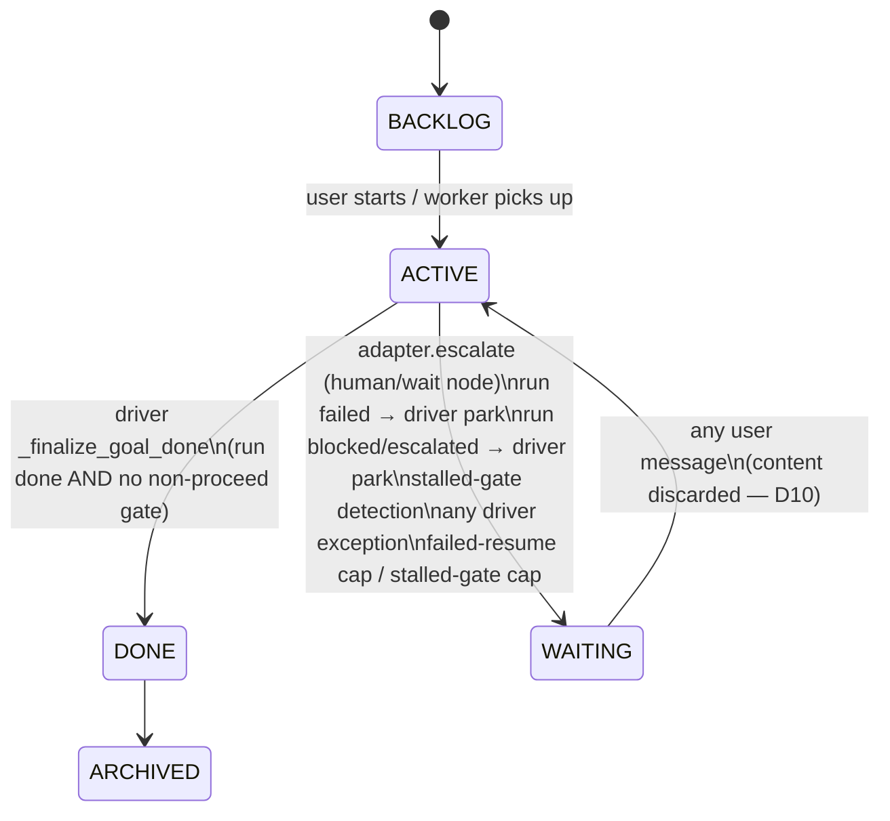
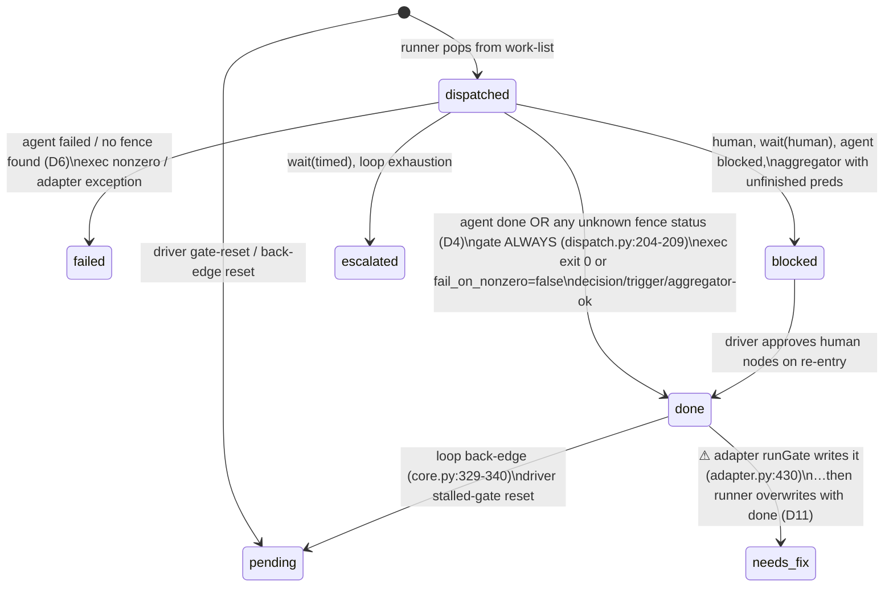

# Delivery/v2 — State Model: As-Is, Failure Mechanics, Target Contract

Companion to `00-assessment.md`. All file:line references are HEAD `8118f5b`.

---

## 1. Vocabulary census

Eight status vocabularies currently participate in a single delivery run. This table is the root-cause map: every defect in the register is a translation error between two rows of it.

| # | Vocabulary | Values | Typed? | Defined in | Written by |
|---|-----------|--------|--------|------------|------------|
| 1 | `TaskState` (goal & child Kanban) | `backlog active waiting done archived` | Enum | `models.py:10-15` | store transitions, finalizer, driver, adapter `escalate` |
| 2 | `WorkflowState.status` (run) | `running done failed blocked escalated` (+ phantom `cancelled` read at `core.py:145`, written by nothing) | Literal (violated) | `state_types.py:27` | runner terminal writes; adapter `escalate` (`blocked`); driver resume patches (`running`) |
| 3 | `NodeState.status` | untyped `str`; observed writers produce `pending done blocked failed escalated needs_fix ""` | **No** | `state_types.py:15` | runner (`core.py:193-208`), adapter `runGate`/`runExec`, driver resume patches, harness mapping (adds `running`) |
| 4 | `node_status` fence | **open** — "any non-empty string, lowercased" | No | `lib/node_status.py:77-81,127-154` | delivery agents (LLM output) |
| 5 | Package `AgentResult.status` | `done blocked needs_fix failed` | Literal (unenforced at runtime; fed raw fence values) | `results.py:16` | `CronosAdapter.dispatchAgent` |
| 6 | `GateResult.decision` | `proceed needs_fix fail retry` | Literal | `results.py:26` | `lib.gate` via adapter |
| 7 | Harness `RunState` node / run | node: `pending in_progress done failed skipped`; run: `running done failed cancelled` | tables | `harnesses/state_mapping.py:6-49` | harness executor/adapter |
| 8 | Backend `AgentResult.status` (child task run) | Cronos agent enum (separate class from #5) | Enum | `agent.py` | agent runner → finalizer → child `TaskState` |

Two semantic collisions deserve explicit note. `blocked` means "parked awaiting a human" in vocabulary 2/3 but maps to "pending / not yet started" in vocabulary 7 (`state_mapping.py:86,97`). `done` at run level means "work-list drained" — which includes dead-ended runs (D5) — while every consumer reads it as "completed successfully."

---

## 2. As-is state machines

### 2.1 Goal (TaskState) — as driven by the delivery path



The single most consequential property: **WAITING is one bucket for five different situations** — legitimate sign-off, node failure, budget/loop escalation, dead-ended routing, and infrastructure error. The only discriminator is the free-text `waiting_question`. The goal layer therefore cannot act differently per cause, and the resume path must *guess* the cause by re-reading pipeline internals — which is exactly what the three `_resume_from_*` heuristics do.

### 2.2 Workflow run (WorkflowState.status) — with actual writers

```mermaid
stateDiagram-v2
    [*] --> running : bootstrap_if_absent (adapter.py:56-77)
    running --> done : work-list drained (core.py:292-298)\n⚠ includes starved/dead-ended runs (D5)
    running --> failed : any node outcome failed (core.py:220-225)
    running --> blocked : node blocked (core.py:213-218)\nadapter.escalate ALWAYS writes blocked (adapter.py:585)
    running --> escalated : wait(timed)/cap/loop-exhaust (core.py:227-232)
    blocked --> running : driver _resume_from_blocked\n(any re-entry = approval — D10)
    failed --> running : implicit — 'failed' not in guard set;\nre-dispatch bounded by sidecar counter
    done --> running : driver _resume_from_stalled_gate\n(gate reset, sidecar counter)
    escalated --> escalated : ⚠ TRAP — guard halts, no driver reset (D7)
```

Note the asymmetry that generates the livelock: `blocked`, `done`(stalled) and `failed` each acquired a bespoke driver-side resume path; `escalated` never did, and the runner's own guard (`core.py:145`) makes it self-sealing.

### 2.3 Node status lifecycle (composite of all writers)



The `needs_fix` transition exists only in the event log — it is written and immediately overwritten (D11). Gate outcomes therefore travel exclusively out-of-band in `NodeState.gate["decision"]`, which is why the driver must inspect gates post-hoc instead of reading node status.

---

## 3. The failing sequence, end to end

This is the exact composition that produces "wrong nodes spawned + spurious waiting" on the shipped spec. It interleaves D1, D2, D3 and D10; D6 can substitute for step 9's failure at any agent node.

```mermaid
sequenceDiagram
    autonumber
    participant U as User
    participant W as Worker/RunExecutor
    participant DR as delivery_driver
    participant R as runner.core
    participant A as CronosAdapter
    participant FS as state.json

    U->>W: start goal (brief has delivery-workflow sentinel)
    W->>DR: run_delivery_goal()
    DR->>R: run(graph, adapter, state_ops)
    R->>A: dispatchAgent(analyze)
    A-->>R: AgentResult done, fields={has_ui: false (JSON bool)}
    R->>FS: write node analyze {status, attempt, artifacts, gate, fields}
    Note over FS: fields SILENTLY DROPPED (D2)\nstore.py:41-63 has no fields key
    R->>A: dispatch signoff-scope (human) → escalate
    A->>FS: status=blocked; goal→WAITING "Right thing to build?"
    R-->>DR: state blocked — halt
    U->>W: reply "no, this needs no UI" (any text)
    W->>DR: run_delivery_goal() again — user text NOT passed (D10)
    DR->>FS: _resume_from_blocked: signoff-scope→done, status→running\n(answer content = approval, discarded)
    DR->>R: run() — resume
    Note over R: seeding (core.py:116-134): for every done node,\ndecrement ALL forward-edge targets' in_degree —\nedge conditions NEVER evaluated (D1)
    R->>A: dispatch frontend  ⚠ wrong node (has_ui was false)
    Note over R: even if seeding evaluated conditions:\nfields gone (D2) and str(True)≠'true' (D3)\n→ BOTH branches false → starved join →\nrun 'done' with pipeline tail unexecuted (D5)
    R->>A: dispatch architect … continues down wrong frontier
```

And the second symptom in isolation:

```mermaid
sequenceDiagram
    autonumber
    participant Agent as Child agent (Claude Code)
    participant TP as trace_parser
    participant A as CronosAdapter
    participant R as runner
    participant DR as delivery_driver

    Agent->>Agent: does the work, writes artifacts
    Agent->>TP: final message: 2.4k chars prose + node_status fence at end
    TP->>TP: final_text_snippet = head-truncate 2000 chars (D6)\nfence amputated
    A->>A: parse_status_envelope(snippet) → None
    A->>A: fallback mtime scan (slug+class scoped) → miss
    A-->>R: AgentResult(status="failed", "No node_status… fence found")
    R->>R: node failed → run failed
    DR->>DR: park goal WAITING\n"a node returned status=failed"
    Note over DR: work exists on disk; child card may even show DONE (D13)
```

---

## 4. As-is terminal mapping matrix

| WorkflowState terminal | Delivery driver → goal | Harness path → task | What it should mean |
|---|---|---|---|
| `done`, no non-proceed gates | DONE | DONE | completed |
| `done`, any gate decision ≠ proceed | WAITING (stalled reason) — false positives for verdict-routed gates (D12) | DONE | ambiguous today: completed *or* dead-ended *or* legitimately routed past a strict gate |
| `failed` | WAITING (generic message) | **DONE** (D16) | node failure needing attention |
| `blocked` | WAITING (escalate already parked) | WAITING | human input required |
| `escalated` | WAITING → livelock on resume (D7) | **DONE** (D16) | policy limit hit (budget/loop/cap) |

Two hosts, three of five rows contradictory. This matrix is the strongest single argument that outcome interpretation belongs **inside the package**.

---

## 5. Target state contract

Design goal: the package owns the *meaning* of every state it emits; hosts translate one well-defined `Outcome` into their own domain and never inspect run internals. Everything below is package-level; the Cronos-specific consequences follow mechanically.

### 5.1 Close the vocabularies at every boundary

One node-outcome taxonomy, validated at ingestion: `done | needs_fix | blocked | failed`. The fence parser keeps its open transport format, but the adapter boundary maps unknown statuses to `failed` with `reason="unknown_status:<raw>"` — never silently to `done` (kills D4). `AgentResult.status` becomes runtime-validated, not annotation-only. `NodeState.status` becomes a Literal: `pending | running | done | needs_fix | blocked | failed | escalated` — and `needs_fix` becomes a *real* node status with a single writer (kills D11): a gate's non-proceed decision is written once, by the runner, as the node status, with the decision detail in `gate`.

Confidence this is the right cut: High for closing the boundary; Medium on keeping `needs_fix` as a node status versus keeping it purely in `gate.decision` — the alternative (decision-only, status stays `done`) preserves today's shape but forces every consumer to special-case gates forever; rejected for that reason.

### 5.2 Make run terminals mean one thing each

`WorkflowState.status` gains one value and loses one phantom: `running | done | stalled | failed | blocked | escalated` (delete the never-written `cancelled` from the guard, or implement cancellation properly — recommended: implement it, since the driver already has a `cancel_event` it can only honor between dispatches today). `done` is emitted **only** when the completeness invariant holds: every node is either executed to a terminal node-status or excluded by an edge condition that was actually evaluated false (the runner must record evaluated-false edges to prove exclusion — a small `edges_evaluated` map in state). Work-list drain without that proof ⇒ `stalled`, carrying `starved_nodes: [...]` (kills D5 in the package and deletes `_stalled_gate_ids`/`_resume_from_stalled_gate` in the driver, including the D12 false positive, because a verdict-routed run past a strict gate *is* complete).

### 5.3 Resume becomes package API, not host archaeology

The package exports the only legal way to re-enter a run:

```
resume(state_ops, graph, event) -> WorkflowState
  event ∈ HumanAnswer(node_id, text, verdict: approve|reject)
        | RetryFailed(node_ids | all)
        | RaiseBudget(new_ceiling)
        | Nothing
```

Semantics owned by the package: `blocked` + `HumanAnswer(approve)` → node done, answer text stored in `fields.answer` (so downstream nodes and edge conditions can use it); `HumanAnswer(reject)` → routes the node's reject edge if declared, else `stalled` with reason (kills D10 — a "no" stops being a "yes"); `failed` + `RetryFailed` → bounded by an `attempt`-based ceiling **persisted in state**, deleting both sidecar counter files; `escalated` + `RaiseBudget`/`RetryFailed` → resumable (kills D7). Seeding inside `resume` replays edge evaluation from persisted scope instead of blanket in_degree decrements (kills D1 — requires 5.4).

### 5.4 Persistence contract, stated and tested

`StateOps` gains a documented round-trip law: *everything the runner writes must read back identically* — enforced by a package-provided conformance test any StateOps implementation must pass (the harness `_StateOps` and `CronosStateOps` both run it). `_serialize`/`_deserialize` gain `fields` (kills D2) and `telemetry`. Scope values become a typed scalar model: bools serialize as `true`/`false`, numbers canonically; `eval_condition` compares typed scalars, and an explicit `exists(path)` guard replaces today's `None != rhs → True` footgun (kills D3 and the missing-key `!=` trap).

### 5.5 Loop and join arithmetic

Single owner for `attempt` (dispatch increments; loop-back does not — kills D8). In_degree bookkeeping replaced by a fired-edge set keyed `(source, target, iteration)` so re-execution cannot double-satisfy a join (kills D9). Wire `reset_downstream_nodes` or delete it — recommended: wire it from the loop-back path, since D2's fix makes stale downstream fields *persistently* stale.

### 5.6 Target goal mapping (Cronos side)

Keep `TaskState` at five values — adding a `FAILED` lane was considered and rejected: it churns board semantics, every view/filter, and migrations, for information the goal card can carry in structure instead. Replace the free-text `waiting_question` convention with a structured `waiting_reason` on the task: `{kind: signoff|node_failed|stalled|budget|infra, node_id, question|reason, run_id}` rendered to text for display. Mapping becomes total and shared by *all* hosts:

| Outcome | Goal action |
|---|---|
| `done` | DONE |
| `stalled(starved_nodes)` | WAITING, kind=stalled — actionable list, no gate archaeology |
| `failed(node, reason)` | WAITING, kind=node_failed — resume offers RetryFailed |
| `blocked(node, question)` | WAITING, kind=signoff — user answer becomes `HumanAnswer(text, verdict)`; verdict inferred by an explicit approve/reject control in the UI, not by message presence |
| `escalated(kind, detail)` | WAITING, kind=budget/loop — resume offers RaiseBudget/RetryFailed |

The harness path consumes the same table (kills D16); its current `else → DONE` collapse disappears.

### 5.7 The classification channel (D6/D13)

The node outcome must stop depending on truncation and mtime inference. Recommended mechanism, in preference order, with the rejected options named:

1. **Adopted:** parse the envelope from the *full* final text at trace-extraction time (`extract_run_trace` already holds untruncated `final_text`, `trace_parser.py:187-256`) and store the parsed block as a structured `node_status: dict | None` field on `RunTrace`; the adapter reads that field. One writer, no truncation sensitivity, and `final_text_snippet` returns to being a UI nicety. Also fix the adjacent latent bug: `final_text = full_text` overwrites with empty when the last turn is tool-only, contradicting its own "last non-empty wins" comment (`trace_parser.py:255-256`).
2. Considered — per-node result file at a path the runner *hands to* the child (`.cronos/delivery-runs/<goal>/<node>.result.json`) and reads back exactly. Stronger (survives trace loss) but touches agent templates and the brief composer; keep as the v2 evolution once (1) has removed the acute pain.
3. Rejected — keep the snippet path and raise the limit again: the failure mode is unbounded (agents write long finals), and this is the patch lineage that got us here.

The mtime fallback scan is then demoted to a diagnostic (log what it *would* have credited) for two releases, then deleted. The dual-classification problem (D13) closes by deriving the child task's Kanban state and the node status from the **same** parsed envelope, with the backend agent result used only for infra-failure detection.

### 5.8 One writer per field

After remediation: node `status/attempt/artifact_paths/gate/fields` are written **only** by the runner through `StateOps`; the adapter's `runGate`/`runExec` state writes are deleted (they exist at `adapter.py:425-445` and `adapter.py:513-527` today); `lib.gate`'s standalone `_write_gate_result` stays available for CLI use but is never combined with a runner-managed `state.json`. The event log then reflects real transitions only.
