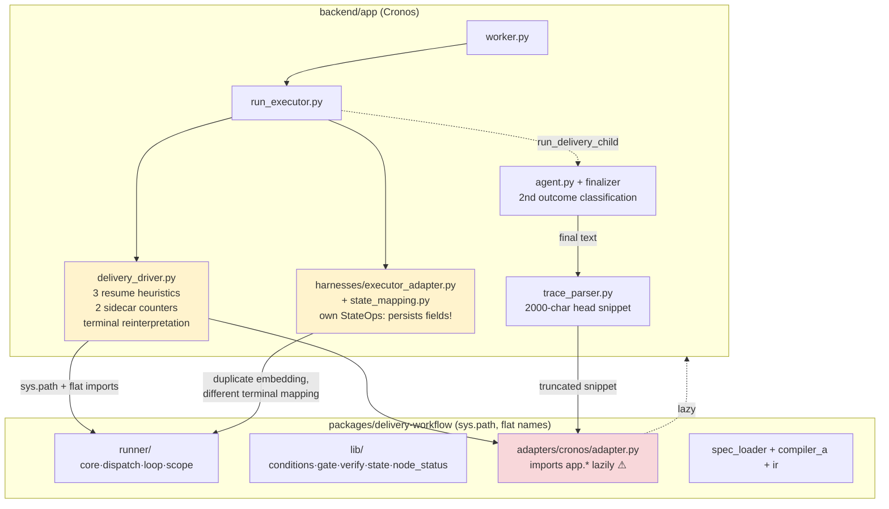
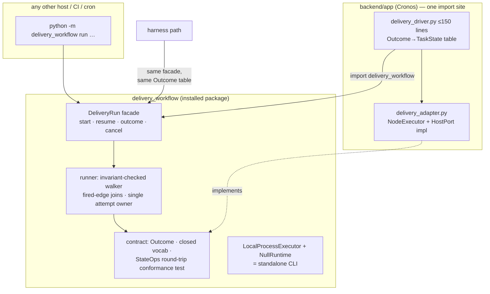

# Delivery/v2 — Package Boundary: Standalone Use and Harness Extension

Companion to `00-assessment.md`. Constraint set, from your brief: (1) the pipeline must be runnable **without Cronos** (future, but designed for now); (2) a clear interface must let new harness types (analysis-only, documentation, db-migration, …) be added without dramatic Cronos changes; (3) no file duplication — execution logic lives once, dependencies point app → package only.

---

## 1. Where the boundary actually is today

The import-linter contract says "portable core never imports app" and largely holds (one dead exception: `lib.verify → app.pipeline.normalize`, whose target was deleted in `758190d`; the whitelist entry in `.importlinter` outlived the module). But portability is not only about import direction — four other properties currently break the standalone story:

**The package is not importable as a package.** The directory is `packages/delivery-workflow` — a hyphen — so nothing can `import delivery_workflow`. Instead, three separate call sites inject the directory onto `sys.path` (`delivery_driver.py:43-50`, `run_executor.py:657-662`, `harnesses/state_mapping.py:70-72`) and import **flat top-level module names**: `lib`, `runner`, `results`, `ir`, `interface`, `state_types`, `compiler_a`, `spec_loader`, `adapters`. `lib` and `results` as top-level names are collision magnets in any embedding host; the first standalone consumer with its own `lib/` will shadow the package silently. Confidence: High — this is structural, verified by every import in the tree.

**The boundary has sprawled to seven app-side import sites** (census in `00-assessment.md`, D15), against the driver's own DD-DRV-01 claim of one. Each extra site is a place a package refactor breaks the host.

**The Cronos adapter lives inside the package** (`adapters/cronos/adapter.py`, 736 lines, lazily importing `app.storage`). This inverts ownership: the portable package carries knowledge of one specific host's TaskStore, TraceStore, event-loop bridging, slug conventions and report locations. A standalone distribution would ship dead Cronos code; a second host would either add `adapters/theirhost/` to *your* package or fork.

**Host-behavioral coupling in package comments and semantics.** `runner/core.py:253-259` dead-ends a gate loop "so the driver parks the goal WAITING with the actionable `_stalled_gate_reason`" — the package's terminal behavior is *designed around* one host's compensation heuristic. That is the deepest form of coupling: no import statement, full semantic dependency.

One terminology note worth settling: the spec's `apiVersion: delivery/v1` while the effort is called delivery/v2 is currently confusing but actually defensible — `apiVersion` names the **spec format**, not the engine generation. Recommendation: keep `delivery/v1` as the format id, add `engine: ">=2,<3"` compat metadata when the outcome/resume contract from `01-state-model.md` lands (that contract change is precisely what a format-consumer needs to detect). Rejected alternative: bump to `delivery/v2` — it would force-migrate every existing spec for a change that is engine-side, not format-side.

### As-is component view



Yellow: host-side compensation layers that exist because the package exports no semantics. Red: ownership inversion.

---

## 2. Target boundary

Three moves, in dependency order. Each is separable; together they make "standalone" a build artifact rather than an aspiration.

### 2.1 Make it a real package

Rename to an importable distribution: directory `packages/delivery_workflow/` (or keep the folder name and add a `src/delivery_workflow/` layout with a `pyproject.toml`), all internal imports become `from delivery_workflow.runner import …`. Cronos installs it editable (`pip install -e packages/delivery-workflow`) in both the repo venv and the Docker image — deleting all three `sys.path` shims and the `PYTHONPATH` Dockerfile coupling. Standalone use becomes `pip install delivery-workflow`. This is mechanical but touches every file once; do it early, because every later fix otherwise lands on the flat-name layout and pays the rename tax again.

Rejected alternative: keep flat modules and rely on `sys.path` discipline. Rejected because the collision risk (`lib`, `results`) is not hypothetical for exactly the standalone consumers you want, and because "one import root" is the cheapest possible enforcement of the single-ownership principle you already apply elsewhere.

### 2.2 Split the executor interface into two ports

Today's `ExecutorInterface` (`interface.py`) conflates two concerns: *executing node work* (`dispatchAgent/runGate/runExec/evalCondition`) and *talking to the host* (`escalate`, and implicitly, via the Cronos adapter, task creation, board parking, SSE). Split them:

```
NodeExecutor (per node-kind capability, package-defined):
    dispatchAgent(ref, inputs) -> AgentResult
    runGate(gate, artifacts)   -> GateResult
    runExec(id, cmd, inputs)   -> ExecResult

HostPort (host-defined, package-consumed):
    on_event(RunEvent)         # node_started/finished, run_blocked(question),
                               # run_stalled(starved), budget_hit — replaces escalate()
    StateOps                   # unchanged shape + round-trip law + conformance test

DeliveryRun (package facade — the ONLY thing hosts call):
    start(spec_path|graph, executor, host, state_ops) -> Outcome
    resume(event: HumanAnswer|RetryFailed|RaiseBudget, …) -> Outcome
    outcome(state_ops) -> Outcome        # pure read, for UIs
    cancel(state_ops)                    # writes the currently-phantom 'cancelled'
```

`Outcome` is the closed taxonomy from `01-state-model.md §5.6`. `evalCondition` leaves the executor entirely — condition evaluation is runner-internal semantics (typed scalars, `exists()`), not a host capability; hosts were only ever asked to implement it because the grammar once lived in `app.harnesses.decision`. The driver shrinks to: detect sentinel → build executor + host port → call `start`/`resume` → translate `Outcome` to `TaskState` via the shared five-row table. Target size: well under 150 lines, zero heuristics, zero sidecar files.

### 2.3 Move the Cronos adapter to the host; ship a reference runtime

`adapters/cronos/` relocates to `backend/app/delivery_adapter.py` (host owns its own adapter — the same one-way rule you enforce everywhere else). The package keeps `null_runtime.py` and gains a `LocalProcessExecutor` reference implementation (spawns `claude -p` directly, reads the per-node result channel) — which **is** the standalone runner: `python -m delivery_workflow run spec.yaml --workdir .` becomes a working CLI with no Cronos anywhere. Rejected alternative: keep the Cronos adapter in-package "so package tests can integration-test against it" — that convenience is precisely what produced synthetic-adapter test blindness; the package conformance suite should run against NullRuntime + LocalProcessExecutor, and the Cronos adapter gets tested in the backend suite where its real dependencies live.

### Target component view



---

## 3. What "adding a harness" costs, before and after

Your concrete extension cases — an analysis-only harness, a documentation harness, a db-migration harness — decompose into three change classes. The table is the acceptance test for the boundary design: a new harness that stays in class A must require **zero** Cronos changes.

| Change class | Example | Touches today | Touches after |
|---|---|---|---|
| **A. New workflow from existing node kinds** | analysis harness = `scout → g-scout → analyze → g-analysis → human`; documentation harness = `doc → g-doc` chain | new spec + agent defs, **plus** driver assumptions (goal-slug/report-location conventions baked into adapter fallback scan), plus schema/class registration in `lib.verify.CLASS_CONFIG`, plus — for the harness path — compiler/state-mapping/finalize divergences | spec YAML + agent defs + (if new artifact class) one `CLASS_CONFIG` entry. Nothing in Cronos. |
| **B. New check type** | db-migration harness wants `{type: migration_dry_run}` gate | edit `lib/gate.py` dispatch table in-package (fine) but adapter's gate enrichment (`adapter.py:396-413`) hardcodes schema-check slug/class injection — every new check risks another special case there | package-side check registry (`register_check("migration_dry_run", fn)`); gate enrichment generalized to a declared `needs: [artifact_class, slug]` per check; adapter untouched |
| **C. New node kind** | `approval-webhook`, `timer` with real sleep | `runner/dispatch.py` handlers **and** driver resume heuristics (a new kind that parks must be taught to `_resume_from_blocked`'s `human_ids` filter, `delivery_driver.py:341-349`) **and** possibly `_stalled_gate_ids` | `runner/dispatch.py` handler + a `resume_semantics` declaration on the kind (how `resume()` treats it). Package-only. |

The current pain concentrates in class A leaking into Cronos through conventions (slug-scoped report scanning, `.cronos/delivery/` tree layout) — those conventions exist only because the result channel is inference-based (D6). Fix the channel and class A collapses to "spec + agents", which is the requirement you stated.

One boundary rule to adopt formally, because the harness path already violated it: **hosts never construct or interpret `WorkflowState`**; they see `Outcome` and `RunEvent` only. The `state_mapping.py` bidirectional tables (`harnesses/state_mapping.py:85-114`) exist to translate between two internal state models across the boundary — after the facade lands, the harness path consumes `Outcome` like every other host and the tables are deleted, which also deletes the `failed→DONE` divergence (D16) by construction.

---

## 4. Open decisions surfaced by this review

Recorded here so they land in the specs rather than in commit messages.

**OD-1 — Reject-path grammar for human nodes.** `resume(HumanAnswer(verdict=reject))` needs a routing target. Options: (a) optional `on_reject:` edge per human node, falling back to `stalled` when absent — recommended, explicit and spec-visible; (b) treat reject as `needs_fix` routed like a gate — rejected, overloads gate semantics onto humans; (c) always stall on reject — rejected, makes "no, but change X and continue" impossible, which is the actual use case your sign-offs exist for.

**OD-2 — Where the answer text lands.** Recommended: `fields.answer` on the human node (flows into scope and downstream briefs once D2 is fixed). Alternative — a dedicated `human_inputs` map on `WorkflowState` — cleaner separation but a second lookup convention for spec authors; rejected for now, revisit if answers need history (multiple rounds per node).

**OD-3 — `stalled` vs `done` for exhausted gate fix-loops.** After the completeness invariant, an exhausted fix-loop should terminate as `stalled(reason=gate_exhausted, node)` rather than today's engineered dead-end-to-`done`. This deletes the `core.py:253-265` host-aware comment block and makes the standalone CLI's exit code honest. No credible alternative; recording it because it reverses an explicit recent design decision (`dcf4347`).
