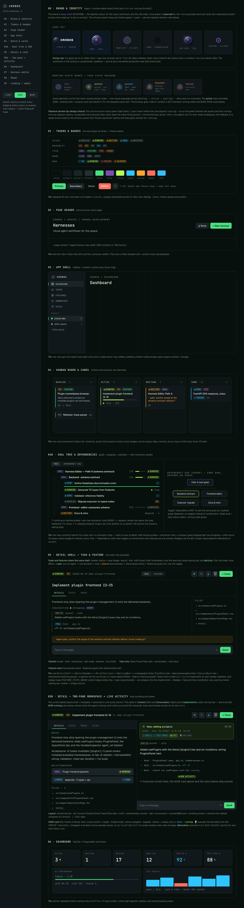
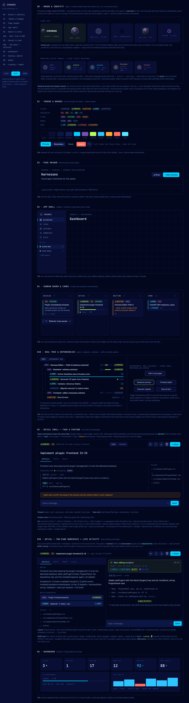

# 4 · Wireframes

> **Single source of truth: [`wireframes/index.html`](wireframes/index.html).**
> The wireframes *are* that interactive file — there is intentionally **no parallel ASCII
> copy** to keep in sync. Open it (`open docs/ui-ux-review/wireframes/index.html`), toggle
> light / dark / neon (top-left rail, or the mobile bar on small screens), and resize to
> see the responsive behaviour. The PNGs at the bottom are **generated from that file**
> (re-rendered on every change) so GitHub/PR readers can view the patterns without opening
> the HTML — they are build output, not a second source.

## Section map

Each section in the HTML, what it demonstrates, and the spec it implements.

| HTML section | Demonstrates | Related spec / finding |
|---|---|---|
| **00 · Brand & identity** | logo set (lockup/mark/flat/mono/app-icon/favicon) + runtime-state marks mapped to the state machine; the lime-reserved rule | [06-brand.md](06-brand.md) · [§2.9](02-design-system.md) |
| **01 · Tokens & badges** | the one `<Badge>` recipe across every tone + token swatches; theme-aware (status values from the brand palette) | [§2.1 color](02-design-system.md) · [§3.1](03-consistency-findings.md) |
| **02 · Page header** | `PageHeader` + `PageContainer` (one title size, breadcrumb, actions, max-width) | [§3.2](03-consistency-findings.md) |
| **03 · App shell** | sidebar nav, active strip, icon+label, focus rings | [§3.6](03-consistency-findings.md) |
| **04 · Board & cards** | lanes + unified card anatomy (default / tight) | [§3.1](03-consistency-findings.md) |
| **04b · Goal tree & DAG** | goal ▸ subgoal ▸ task tree with connector guides + Dependency-DAG toggle | [§3.10b](03-consistency-findings.md) |
| **05 · Detail shell — task & feature** | one shell, two payloads (live Task ⇄ Feature toggle) | [§3.10c](03-consistency-findings.md) |
| **05b · Two-pane workspace + activity** | Context \| Conversation split (independent scroll) + pinned **NOW-running** card (animated brand `active` mark) | [§3.10d](03-consistency-findings.md) |
| **06 · Dashboard** | `StatTile` + `ProgressBar` primitives | [§2.8 catalog](02-design-system.md) |
| **07 · Harness editor** | node flow; node tones use status tokens; running node carries the animated brand `active` mark | [§3.1](03-consistency-findings.md) · [06-brand.md §6.3](06-brand.md) |
| **08 · Modal** | one scrim / escape / focus-trap contract | [§3.4](03-consistency-findings.md) |
| **09 · Loading & empty** | skeleton (no CLS) + empty / error states | [§3.8](03-consistency-findings.md) |

Notation used in the HTML: `▎` accent strip · `●` status dot · `··` pulse/live ·
`▓▓░` progress · `⌘⏎` send. All chrome uses semantic tokens; every badge uses the one
`<Badge tone>` recipe from [§2.1](02-design-system.md).

## Responsive (built into the HTML)

- **MacBook (≥1024px):** full gallery; task detail shows both panes side by side.
- **iPad (768–1024px):** rail kept; board → 2 lanes; two-pane workspace stays side by side.
- **iPhone 17 (<768px):** sticky mobile bar (theme L/D/N), swipeable board lanes, the
  two-pane workspace collapses to a `Context | Conversation` tab switch, and the
  NOW-running card stays pinned while the transcript scrolls.

## Static previews (generated — not a second source)

| Dark (operator console) | Light (editorial paper) | Neon (midnight navy) |
|---|---|---|
|  |  |  |

Regenerate after editing `index.html` (run from `docs/ui-ux-review/wireframes/`):

```sh
CH="/Applications/Google Chrome.app/Contents/MacOS/Google Chrome"
"$CH" --headless --disable-gpu --screenshot=preview-dark.png --window-size=1320,4400 "file://$PWD/index.html"
for T in light neon; do
  sed "s/data-theme=\"dark\"/data-theme=\"$T\"/" index.html > _t.html
  "$CH" --headless --disable-gpu --screenshot=preview-$T.png --window-size=1320,4400 "file://$PWD/_t.html"
  rm -f _t.html
done
```
