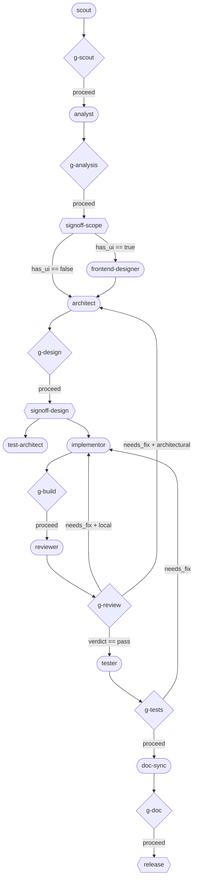

# delivery/v1 — User Guide

A layered guide to the delivery-workflow package. Read the part that matches your role:

- **[Part 1: Concepts](#part-1--concepts)** — the mental model (everyone).
- **[Part 2: Operating a pipeline](#part-2--operating-a-pipeline)** — running a delivery and
  answering its gates (operators).
- **[Part 3: Authoring a workflow spec](#part-3--authoring-a-workflow-spec)** — writing or
  customizing `delivery.workflow.yaml` (authors).
- **[Part 4: Integrating a runtime](#part-4--integrating-a-runtime)** — running delivery/v1 on
  a new backend (integrators).

For lookup tables (agents, gate checks, artifact classes, condition grammar), see
[`reference.md`](reference.md).

---

## Part 1 — Concepts

### What delivery/v1 is

delivery/v1 is a **workflow specification plus an agent bundle** for shipping a software change
end to end. You give it a feature request; it runs a fixed sequence of specialized agents —
each backed by a Claude model tier — that research the codebase, decompose requirements, design
an implementation, build it, review it, test it, and update the docs. Between every agent sits
a **gate** the runtime evaluates itself, and at three points the run **pauses for a human**.

The whole thing is described by one file, [`delivery.workflow.yaml`](../delivery.workflow.yaml):
a directed graph of `nodes` (agents, gates, humans) connected by `edges` (some conditional).

### The five stages and nine agents

```
   RESEARCH        ANALYZE            DESIGN                BUILD                 VERIFY              DOCUMENT
  ┌────────┐    ┌──────────┐   ┌──────────────────┐   ┌─────────────┐    ┌──────────────────┐    ┌──────────┐
  │ scout  │ →  │ analyst  │ → │ frontend-designer│ → │ implementor │ →  │ reviewer         │ →  │ doc-sync │
  │        │    │          │   │ architect        │   │             │    │ tester           │    │          │
  └────────┘    └──────────┘   │ test-architect   │   └─────────────┘    └──────────────────┘    └──────────┘
                               └──────────────────┘
```

| Agent | Tier | Does | Produces (artifact class) |
|---|---|---|---|
| **scout** | Haiku | Reconnaissance of the codebase & memory | `research` |
| **analyst** | Sonnet | Decomposes request into requirements (REQ-ids), decides `has_ui` | `analysis` |
| **frontend-designer** | Sonnet | Mockups + FE spec — *only if the analyst set `has_ui`* | `frontend` |
| **architect** | Opus | An iterations DAG (DD-ids) + a risk register | `design` |
| **test-architect** | Opus | A test suite + test plan (TC-ids) | `test` |
| **implementor** | Sonnet | Builds one iteration of the design | `implementation` |
| **reviewer** | Opus | Judges the diff against the design; emits a verdict | `review` |
| **tester** | Sonnet | Runs the test suite, reports coverage | `test` |
| **doc-sync** | Haiku | Updates docs for the changed files | `doc` |

Only three agents may write existing project files — **test-architect, implementor, doc-sync** —
over disjoint file trees. The two agents that *judge* quality (reviewer, tester) have **no edit
capability**, so they can never patch what they are evaluating. That separation is a deliberate
guardrail, not an accident.

### Gates: trust nothing, re-verify everything

After (almost) every agent node there is a **gate node**. A gate is a list of deterministic
`checks` the runtime runs against the artifact the agent just produced — for example `schema`
(does the artifact validate?), `traceability` (is every REQ-id covered?), `build` / `lint` /
`types`, or `test`. A gate returns a `decision` — one of `proceed`, `needs_fix`, `retry`, `fail`:

- **`proceed`** — checks pass; the run advances down the matching edge.
- **`needs_fix`** / **`retry`** — recoverable; the run loops back to an earlier node.
- **`fail`** — unrecoverable. A `fail` (or a budget breach, or an exhausted loop) is what
  *escalates* the run — parking it for a human.

Crucially, gates do **not** read the agent's prose or trust a self-reported "PASS." Every routing
decision is derived from machine-readable fields. (Agents emit those fields in a fenced
`delivery_status` block — see [the structured return](#how-agents-report-back).)

### Human checkpoints

Three nodes are `kind: human` — the run **pauses and waits** for a person:

1. **Scope sign-off** — *"Right thing to build?"* (after analysis)
2. **Design sign-off** — *"Right design?"* (after design)
3. **Release** — *"Sign-off to release."* (after docs)

On Cronos a paused run surfaces as a task in the **WAITING** lane carrying the question.

### Loops: converge or stall

Two phases repeat until they succeed:

- **Review loop** — repeats until `verdict == 'pass'`, up to **5** attempts. If it keeps
  surfacing the same findings or the diff stops changing (a *stall*), it escalates.
- **Test loop** — repeats until the test gate says `proceed`, up to **3** attempts.

A failing review routes the work *back to the right place*: a **local** finding goes back to the
implementor; an **architectural** finding goes back to the architect.

### Budget & escalation

`defaults.budget.usd_ceiling` caps the run. Every node emits telemetry (`tokens`, `usd`,
`seconds`); the runtime accumulates it. If the cumulative spend crosses the ceiling, the runtime
raises a budget signal and **escalates** — the run blocks for a human rather than burning more.

### State & telemetry: where a run's truth lives

A run persists two files in its run directory:

- **`state.json`** — the `WorkflowState`: the spec, a `run_id`, overall `status`, the `budget`,
  and a `nodes` map (per-node `status`, `attempt` count, `artifact_paths`, gate result). Written
  atomically (temp file + rename) so a crash can't corrupt it.
- **`events.jsonl`** — an append-only log of node transitions, for audit and replay.

Because state is durable and idempotent, a run can **resume** after a crash or upgrade: done
nodes are skipped, failed/torn nodes are re-dispatched, absent nodes run for the first time.

### How agents report back

Every agent ends its turn with a fenced **`delivery_status`** block — the runtime's routing
surface. It is *not* free-text; the runtime parses these fields, never the prose:

````
```delivery_status
{
  "status": "done",                       // done | blocked | needs_fix | failed
  "produces": "implementation",           // the artifact class
  "artifact_paths": ["<runtime-given path>"],
  "fields": {                             // the routing surface — only the keys this node needs
    "files_changed": ["src/x.py", "tests/y.py"],
    "validation_command_passed": true
  },
  "open_questions": [],
  "telemetry": { "tokens": 12345, "usd": 0.18, "seconds": 42 }
}
```
````

Agents never hardcode where artifacts go — the runtime hands them `artifact_paths` and they write
there. This is what keeps the bundle portable across runtimes.

### The full graph

This is the shipped [`delivery.workflow.yaml`](../delivery.workflow.yaml). Gate nodes are
prefixed `g-`; human nodes are diamonds.



---

## Part 2 — Operating a pipeline

> **Today this means running on Cronos.** The standalone runner is a future phase
> ([Part 4](#part-4--integrating-a-runtime)). On Cronos, the `CronosAdapter`
> ([`adapters/cronos/adapter.py`](../adapters/cronos/adapter.py)) is the executor.

### 1. Start a run

You start a delivery by handing the runtime a **workflow spec** and a **request**. On Cronos this
is wired through the backend pipeline machinery: a tracking task is created, the workflow spec
becomes the control plan, and the adapter dispatches each agent node as a child task.

What you provide:

- **The workflow spec** — usually the shipped [`delivery.workflow.yaml`](../delivery.workflow.yaml),
  or your own (see [Part 3](#part-3--authoring-a-workflow-spec)).
- **The request** — the feature/change description the scout and analyst will work from.
- **A budget ceiling** (optional) — overrides `defaults.budget.usd_ceiling`.

The adapter takes care of the rest: creating child tasks, polling them to completion, parsing
each `delivery_status`, running gates, evaluating conditional edges, and persisting state.

### 2. Watch it flow

As the run progresses, each node transition is written to `state.json` and appended to
`events.jsonl`. On the Cronos board you see child tasks appear and move through their lanes; the
node statuses in `state.json` (`pending → running → done/failed`) are the source of truth.

A node's `artifact_paths` tell you where its deliverable landed — e.g. the scout's `research`
report, the architect's `design` report with its iterations and risks, the reviewer's verdict.
Reading these in order is the best way to follow *why* the run made the choices it did.

### 3. Answer the human gates

When the run reaches a `human` node it **pauses**. On Cronos the tracking task moves to the
**WAITING** lane with the gate's question as its `waiting_question`:

| Gate | Question | What you're deciding |
|---|---|---|
| `signoff-scope` | "Right thing to build?" | Did the analyst capture the *right* requirements & scope? |
| `signoff-design` | "Right design?" | Is the architect's iterations DAG the design you want built? |
| `release` | "Sign-off to release." | Are the diff, tests, and docs good to ship? |

Approving the task lets the run continue down the outgoing edge. These are your control points —
catching a wrong-scope or wrong-design decision here is far cheaper than catching it after the
build.

### 4. Handle loops and escalations

You usually don't need to intervene in the **review** and **test** loops — they converge on their
own. You'll be pulled in when:

- **A loop exhausts its attempts** (review > 5, tests > 3) → the run **escalates** (parks WAITING).
  Read the latest `review`/`test` artifact for the recurring finding, fix the underlying issue (or
  adjust scope/design), and resume.
- **The budget ceiling is breached** → the run escalates with a budget reason. Either raise the
  ceiling and resume, or stop the run.
- **A gate fails unrecoverably** → the run parks. The gate's `errors`/`evidence` (in `state.json`)
  tell you which check failed.

### 5. Resume

Because state is durable, a parked or crashed run can be resumed against the same run directory.
The runtime skips `done` nodes, re-dispatches `failed`/torn ones, and continues. You don't restart
from scratch.

### Reading a run after the fact

Everything you need to reconstruct a run lives in the run directory:

- `state.json` — final statuses, per-node artifacts, gate results, total budget spent.
- `events.jsonl` — the ordered transition log.
- The artifact files referenced by each node's `artifact_paths`.

---

## Part 3 — Authoring a workflow spec

You don't have to use the shipped graph. A workflow is just a `delivery.workflow.yaml` validated
against [`schemas/delivery.workflow.schema.yaml`](../schemas/delivery.workflow.schema.yaml). You
can trim phases, change models, add gates, or rewire routing.

### Top-level shape

```yaml
apiVersion: delivery/v1          # required, must be exactly "delivery/v1"
metadata:
  name: sdlc-delivery            # required
  description: "..."             # optional
defaults:
  models:                        # tier aliases the nodes refer to
    reasoning: opus
    build: sonnet
    recon: haiku
  budget:
    usd_ceiling: 25.0            # required if budget present
    on_exceed: escalate          # escalate | fail
nodes: [ ... ]                   # required, ≥1
edges: [ ... ]                   # required
traceability:                    # optional
  require: [REQ, DD, TC]
  artifact: "..."
```

Validate any spec before using it:

```python
from spec_loader import load_spec
load_spec("delivery.workflow.yaml")   # raises ValueError listing every schema error
```

### Three node kinds

**Agent node** — runs an agent and produces an artifact:

```yaml
- id: implement
  kind: agent
  agent: implementor              # an agent in agents/
  model: {use: build}            # references defaults.models.build
  tools: [Read, Edit, Write, Bash, Grep, Glob]   # exact allowlist
  inputs: {from: [architect]}    # upstream nodes whose artifacts to read
  produces: {class: implementation}
  recon: on                      # may dispatch scout for transient recon (see below)
  loop: { ... }                  # optional convergence loop
  budget: {usd_ceiling: 10.0}    # optional per-node ceiling
```

**Gate node** — re-verifies the upstream artifact:

```yaml
- id: g-build
  kind: gate
  checks:
    - {type: build}
    - {type: lint}
    - {type: types}
  on_fail: block                 # block | retry_upstream (optional)
  loop: { ... }                  # optional (e.g. the test gate)
```

Check `type`s: `schema`, `traceability` (with `of: REQ|DD|TC`), `acceptance`, `build`, `lint`,
`types`, `test`, `diff_vs_acceptance`, `custom`.

**Human node** — pauses for a person:

```yaml
- id: signoff-design
  kind: human
  prompt: "Right design?"
```

### Edges and conditional routing

Edges connect nodes; a `when` makes the edge conditional:

```yaml
edges:
  - {from: scout, to: g-scout}
  - {from: g-scout,   to: analyze,   when: "g-scout.decision == 'proceed'"}
  - {from: signoff-scope, to: frontend,  when: "analyze.fields.has_ui == true"}
  - {from: signoff-scope, to: architect, when: "analyze.fields.has_ui == false"}
  - {from: g-review,  to: implement, when: "review.fields.verdict == 'needs_fix' && review.fields.finding_class == 'local'"}
```

A `when` expression reads `<node>.decision` (gates) or `<node>.fields.<key>` (agents). The
condition grammar: dotted/hyphenated identifiers, `==`, `!=`, `in`, conjunction with `&&`, and
parentheses. **Every root identifier must resolve to a node `id`** — referencing recon output (which
has no node id) is a lint error (rule R11, [`recon_lint.py`](../recon_lint.py)).

### Loops

```yaml
loop:
  until: "review.fields.verdict == 'pass'"   # required
  stall: [recurring_findings, no_diff_progress]
  max: 5                                       # attempt ceiling
  on_exhaust: escalate                         # escalate | fail
```

### Recon-on-demand

A node with `recon: on` may dispatch the **scout** agent at its own startup for a transient,
iteration-scoped map — useful for the implementor (fresh map of changing code), reviewer (invariants
around the diff), and architect (re-design). Recon output is **transient context only**: it is *not*
a gated artifact, *not* a DAG node, and *never* visible to `evalCondition`. Its telemetry counts
against the node's budget. Don't add `Agent` to an agent's `tools` — the runtime grants it.
Full contract: [`recon/README.md`](../recon/README.md).

### Authoring tips

- **Keep agents thin, skills thick.** An agent definition is a role + I/O contract (≤~80 lines);
  the *method* lives in its paired skill under [`skills/`](../skills). See
  [`agents/README.md`](../agents/README.md) for the harvest-then-author pattern.
- **Tool allowlists are exact** — no wildcards. Judging agents (reviewer, tester) get no `Edit`.
- **Match `produces.class` to a schema** in [`schemas/`](../schemas) so the `schema` gate can validate it.
- **Trace your DAG** — every `when` identifier must be a real node id; run `load_spec` and the recon
  lint before shipping a spec.

---

## Part 4 — Integrating a runtime

delivery/v1 is portable because the agents, skills, and spec carry **no runtime-specific paths or
API calls**. A runtime adopts the pipeline by implementing one small interface; the package enforces
the boundary so the portable core never imports a specific backend.

### The 6-operation executor interface

Implement [`ExecutorInterface`](../interface.py) — a runtime-checkable Protocol:

```python
class ExecutorInterface(Protocol):
    state: StateOps        # read()/write(patch) the WorkflowState
    telemetry: TelemetryOps  # emit(node_id, {tokens, usd, seconds})

    def dispatchAgent(self, agent_ref: str, inputs: dict) -> AgentResult: ...
    def runGate(self, gate: dict, artifact_paths: list[str]) -> GateResult: ...
    def evalCondition(self, expr: str, scope: dict) -> bool: ...
    def escalate(self, node_id: str, reason: str) -> None: ...
```

| Operation | Your job |
|---|---|
| `dispatchAgent` | Run the named agent with the given inputs; return its `delivery_status` as an `AgentResult` (`status`, `artifact_paths`, `produces`, `fields`, `open_questions`, `telemetry`). |
| `runGate` | Execute the gate's checks against the artifacts; return a `GateResult` (`decision`, `errors`, `evidence`). |
| `evalCondition` | Evaluate an edge `when` against a scope; return a bool. |
| `state.read/write` | Load / atomically patch the `WorkflowState`. |
| `telemetry.emit` | Record per-node telemetry; accumulate against the budget ceiling. |
| `escalate` | Route a node to human intervention. |

### What the package gives you for free

You don't have to build persistence from scratch — the portable [`lib/`](../lib) provides reference
implementations you can wire in:

- **[`lib/state/StateStore`](../lib/state/store.py)** — atomic `state.json` read/write + a resume
  policy (`skip` done nodes, `re-dispatch` failed, `dispatch` absent).
- **[`lib/state/EventLog`](../lib/state/events.py)** — append-only `events.jsonl`.
- **[`lib/telemetry/TelemetrySink`](../lib/telemetry/sink.py)** — accumulates tokens/USD and raises
  `BudgetExceededSignal` on ceiling breach.
- **[`lib/delivery_status`](../lib/delivery_status.py)** — parse the `delivery_status` block from
  agent output.
- **[`spec_loader`](../spec_loader.py)** — load + schema-validate a workflow spec.
- **[`null_runtime`](../null_runtime.py)** — a `NullRuntime` stub for testing your wiring.

### The import boundary (don't cross it)

The portable core **must not** import a specific backend. This is enforced two ways:

1. **`import-linter`** ([`.importlinter`](../.importlinter)) — forbids `app.*` / `backend.*` in the
   core; runs in CI.
2. **`test_import_boundary.py`** — AST-scans every module for forbidden imports.

Your adapter is the *one* place allowed to import your backend, and only it. The reference adapter,
[`adapters/cronos/`](../adapters/cronos/), is explicitly excluded from the rule and keeps all its
`app.*` imports **lazy** (inside methods) so importing the bundle core never transitively pulls in
Cronos. Mirror that pattern.

### Worked example: the Cronos adapter

[`adapters/cronos/adapter.py`](../adapters/cronos/adapter.py) is a complete, shipped reference:

| Portable op | Cronos mapping |
|---|---|
| `dispatchAgent` | Create a child task → poll to DONE/WAITING → load the run trace → parse `delivery_status`. |
| `runGate` | Delegate to the Cronos gate engine; map its result to `GateResult`. |
| `evalCondition` | Delegate to the harness decision evaluator. |
| `state.read/write` | `CronosStateOps` → `StateStore` + `EventLog`. |
| `telemetry.emit` | `CronosTelemetryOps` → `TelemetrySink` (with budget ceiling). |
| `escalate` | Park the tracking task → WAITING with a `waiting_question` (idempotent). |

Read [`adapters/cronos/README.md`](../adapters/cronos/README.md) for the full operation-by-operation
walkthrough, including delivery-status fallback parsing and error handling.

### Build & test your runtime

```bash
cd packages/delivery-workflow
pip install -e ".[dev]"
pytest tests/ -v          # 231 tests: interface, state, telemetry, spec loading, import boundary
lint-imports              # verify you haven't crossed the boundary
```

Start by making `NullRuntime` pass the protocol checks, then implement one operation at a time,
leaning on the `lib/` helpers for state and telemetry.

---

## Where to go next

- **Reference tables** — [`reference.md`](reference.md)
- **Agent contract & roster** — [`../agents/README.md`](../agents/README.md)
- **Cronos adapter deep-dive** — [`../adapters/cronos/README.md`](../adapters/cronos/README.md)
- **Recon isolation contract** — [`../recon/README.md`](../recon/README.md)
- **The shipped graph** — [`../delivery.workflow.yaml`](../delivery.workflow.yaml)
